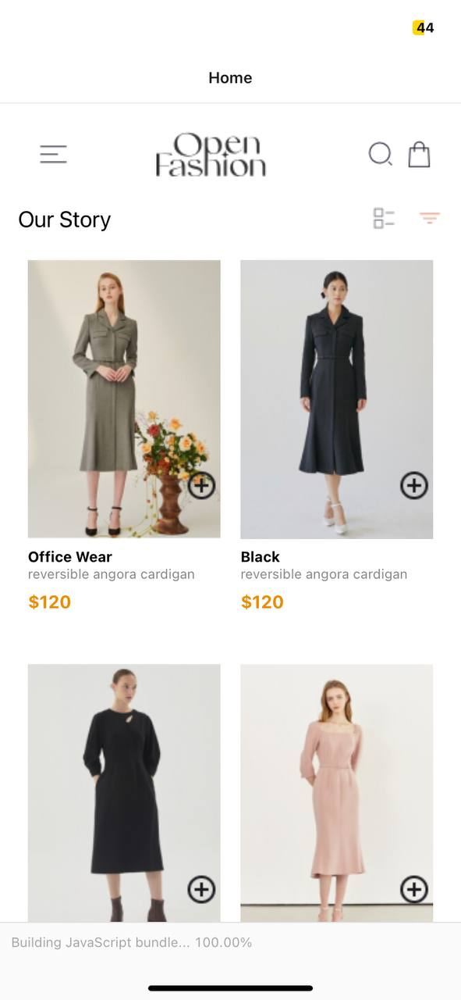
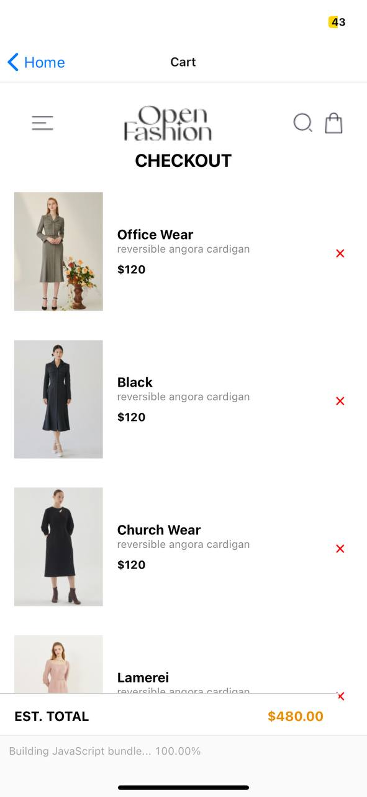

# Rn-assignment6-11293982
## Overview
The design of this mobile application prioritizes usability and aesthetics to deliver a smooth user experience. A Home screen and a Cart screen are included in the app. Additionally,  It also supports the use of Local Storage (AsyncStorage, SecureStore, or FileSystem) to store selected items locally on the device.

## Features of the app
- Home Screen: Shows the user a list of the products that are offered.
- Carts Screen: Shows the user's selected products while calculating the total cost of the items.
- Add to cart button:  allows the user to add items to their cart.
- Remove from cart button:  allows the user to take items out of their cart.

### Technologies used
- React Native: For building the mobile application.
- React Navigation: For handling navigation within the app.
- Styled Components: Styles the application to match the provided UI design. 
- Local Storage: Store Items locally on device
- Custom Components: Created reusable custom components to maintain consistency and reusability across the app.

## Process for developing the app
- Setup: Started with setting up the React Native environment and starting the app.
- Navigation: Implemented React Navigation for managing screen navigations.
- UI Design: Styled the application using Styled Components to match the provided UI mockup.
- Custom Components: Created reusable custom components for headers, buttons, and other UI elements.
- Testing: Tested the application on various devices to ensure compatibility and responsiveness.
## Screenshot

